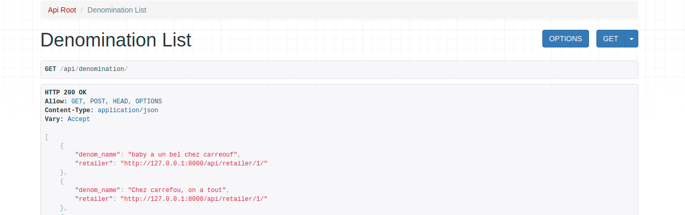
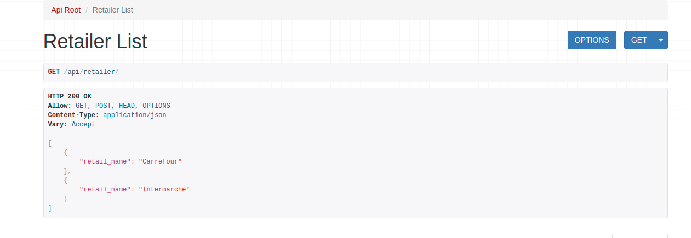
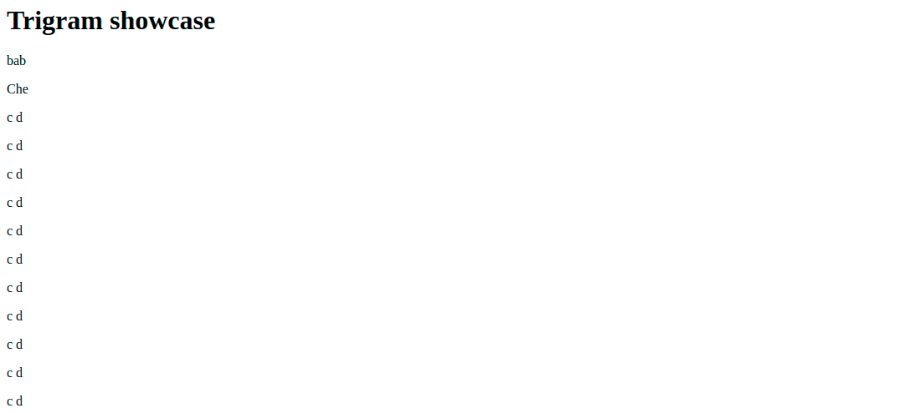

# Django showcase 

This is Django project was built, to test a few ideas I had

- Create a data import page through this URL `http://127.0.0.1:8000/upload-file/` (Note: Please use CSV file to load the data. No need of comma to separate the column, at least for now)
- Show a trigram of the data in the DB through this URL `http://127.0.0.1:8000/denom_list/`
- API GET and POST for Denomination model `http://127.0.0.1:8000/api/denomination/`
- API GET and POST for Retailer `http://127.0.0.1:8000/api/retailer/`
- API GET and POST for denomretail `http://127.0.0.1:8000/api/denomretail/`
- Admin web page `http://127.0.0.1:8000/admin`

Next steps are the following: 

- Change SQLite DB to a Postgres DB and maybe setup a Docker for hosting the Postgres DB - done for the postgres. Needs to be done for the docker part.
- Adding extra columns on the models for retailers and denomination done
- Adding an extra endpoint done
- Add CSS in the pages mentioned above
- Add swagger doc
- Needs to clean the URL part in url.py

Endpoint note : Adding an endpoint need to be done the following way -> add the path in url.py -> add the viewset in views.py and add the serializer in serializer.py

Please find a screencap for the pages mentioned above :

Home

API denomination

API retailer

Trigram

